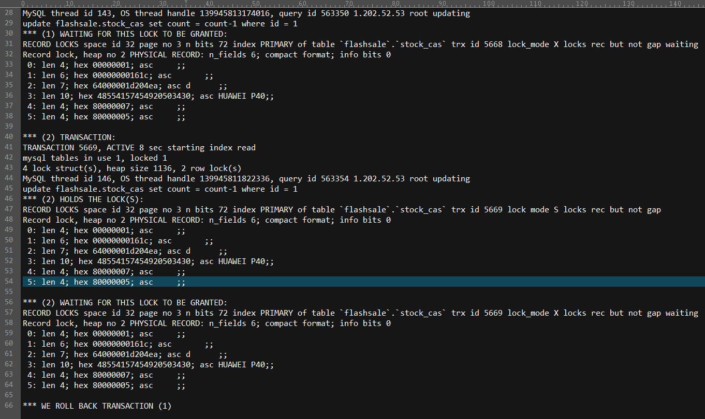

# 又创建了一个项目


项目创建参考：

> https://github.com/SymonLin/demo
>
> https://github.com/qqxx6661/miaosha


```mysql
-- ----------------------------
-- Table structure for product
-- ----------------------------
DROP TABLE IF EXISTS `product`;
CREATE TABLE `product` (
  `id` 		int(11) unsigned	NOT NULL AUTO_INCREMENT	COMMENT '自增id',
  `name` 	varchar(50) 		NOT NULL DEFAULT '' 	COMMENT '名称',
  `count` 	int(11) 			NOT NULL 				COMMENT '库存, 乐观锁可复用此字段避免新增版本号字段',
  PRIMARY KEY (`id`)
) ENGINE=InnoDB DEFAULT CHARSET=utf8mb4 COMMENT='通过乐观锁解决超卖问题';
```


```mysql
-- ----------------------------
-- Table structure for order
-- ----------------------------
DROP TABLE IF EXISTS `order`;
CREATE TABLE `order` (
  `id`          int(11) unsigned NOT NULL AUTO_INCREMENT,
  `pid`         int(11)          NOT NULL COMMENT '商品ID',
  `name`        varchar(30)      NOT NULL DEFAULT '' COMMENT '商品名称',
  `create_time` timestamp        NOT NULL DEFAULT CURRENT_TIMESTAMP ON UPDATE CURRENT_TIMESTAMP COMMENT '创建时间',
  PRIMARY KEY (`id`)
) ENGINE=InnoDB DEFAULT CHARSET=utf8mb4;
```


`@Transactional` 注解的默认隔离级别是可重复读 REPEATABLE_READ 因此仅在如下伪代码中加入 `@Transactional` 注解是不能解决超卖的，依然会产生超卖。原因是可重复读的 select 是快照读，假设库存还有1个两个请求同时执行，则校验库存时都会通过（因为是快照读，读的都是1），因此就会出现同时下单成功的结果

```java
@Transactional
void createOrder(id) {
	// 1. 查询并校验库存
	SELECT s.id, s.`name`, s.stock FROM product s WHERE s.id = #{id}
	if(stock <= 0 ) {
		throw new RuntimeException("sale out");
	}
	// 2. 更新库存
	UPDATE product set count = count-1 WHERE id = #{id}
    // 3. 创建订单
    insert into order(pid, name, create_time) 
                values(#{pid}, #{name}, #{createTime, jdbcType=TIMESTAMP})
}
```

此时，可通过以下方法优化：

1. 将隔离级别改为**串行化** `@Transactional(isolation = SERIALIZABLE)` ，此时，上面的 select 语句会隐式带有 `lock in share mode`（加了 S 锁即读锁），但是在上面的场景下使用 S 锁不是很好，因为当两个线程同时走到这里时，至少有一方会出现死锁，最终由 MySQL 主动回滚死锁的一方然后尝试重新获取锁，具体可见 https://dev.mysql.com/doc/refman/5.7/en/innodb-locking-reads.html，因此这就引入下一种方案

   

2. 同样使用串行化，但是显式的在 select 语句加上 `for update`（加了 X 锁即写锁），相当于提前锁住资源，这样就不会产生死锁。但由于和第1种方法一样是串行化隔离界别，因此效率很低，优点就是库存肯定不会超卖，订单也不会多下；

3. 通过乐观锁，由于MySQL并没有实现乐观锁


